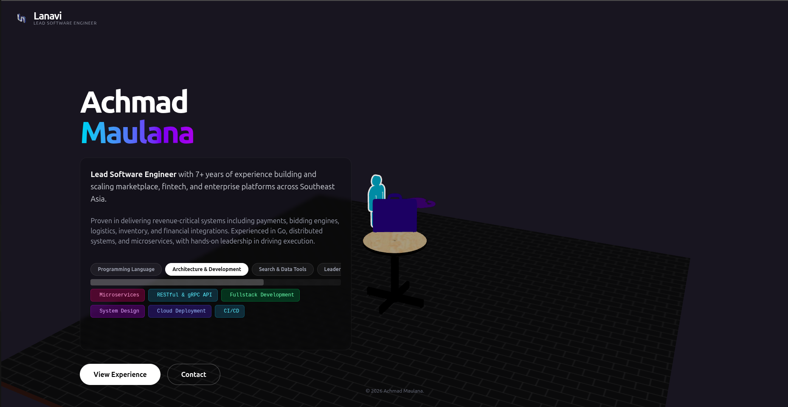

# Lanavi 3D Portfolio



A high-performance, immersive 3D portfolio website built with React, Three.js, and Framer Motion. This project features a 3D interactive room, detailed project cards, and a sleek, modern UI.

## Tech Stack

- **Framework**: [React](https://react.dev/) + [Vite](https://vitejs.dev/)
- **Language**: [TypeScript](https://www.typescriptlang.org/)
- **3D Graphics**: [Three.js](https://threejs.org/) + [React Three Fiber](https://docs.pmnd.rs/react-three-fiber) + [Drei](https://github.com/pmndrs/drei)
- **Animations**: [Framer Motion](https://www.framer.com/motion/)
- **Styling**: [TailwindCSS](https://tailwindcss.com/)
- **Icons**: [React Icons](https://react-icons.github.io/react-icons/)

## Features

- **Interactive 3D Scene**: A 3D room with revolving icons that navigates between sections.
- **Glassmorphism UI**: Modern, translucent overlays with blur effects.
- **Dynamic Content**: Data-driven experience and project sections.
- **Responsive Design**: optimized for both desktop and mobile viewing (3D scene adjusts accordingly).
- **Project Details**: Clickable project cards with detailed modals, GitHub/Live links, and tech stack tags.

## Getting Started

1.  **Clone the repository:**
    ```bash
    git clone https://github.com/maulinouno/portfolio.git
    cd portfolio
    ```

2.  **Install dependencies:**
    ```bash
    npm install
    # or
    yarn install
    ```

3.  **Run the development server:**
    ```bash
    npm run dev
    ```

4.  **Build for production:**
    ```bash
    npm run build
    ```

## Project Structure

```
src/
├── components/         # React components
│   ├── ModelIcon.tsx       # Single 3D Icon component
│   ├── RevolvingIcons.tsx  # Group of rotating 3D icons
│   ├── Room.tsx            # Main 3D Scene
│   ├── Overlay.tsx         # 2D UI Overlay (Navigation, Content)
│   ├── ProjectCard.tsx     # Project item card
│   └── ProjectDetailModal.tsx # Detailed project view
├── data/               # JSON data files (profile, experiences, contact)
├── utils/              # Helper functions (colors, icons)
├── App.tsx             # Main entry point
└── main.tsx            # DOM renderer
public/
├── assets/             # 3D models (.glb) and images
└── projects/           # Project screenshots
```

## Credits

Designed and developed by **Achmad Maulana** (Lanavi).
